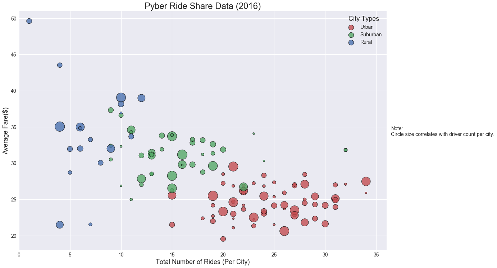
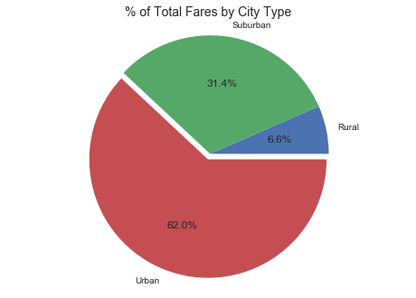
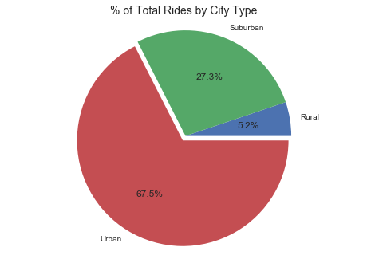
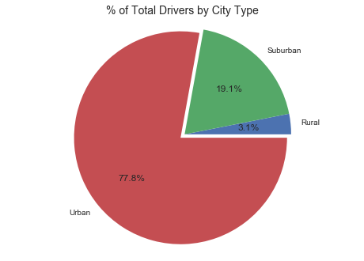

# Pyber Ride Sharing

### Analysis
- Most rides were given in Urban cities, and were also the cheapest on average.
- While to most demand for rides was in Urban cities, the average number of rides given per driver was ~0.6, whereas  Suburban drivers averaged 72% more rides (~1.03) and Rural drivers got twice the amount (~1.2).
- Rural drivers made 2.7 times more on average than urban drivers, and suburban drivers made 2 times urban drivers.

## Bubble Plot for Ride Sharing Data


```python
# Dependencies and Setup
import pandas as pd
import matplotlib.pyplot as plt
import numpy as np
import seaborn as sns

#Set seaborn default color scheme
deep=["#C44E52", "#55A868", "#4C72B0", "#8172B2", "#CCB974", "#64B5CD"]
palette={cityTypes[0]:deep[0],
         cityTypes[1]:deep[1],
         cityTypes[2]:deep[2]}
sns.set(palette='deep')

# Locations for csv files
rideCSV = 'raw_data/ride_data.csv'
cityCSV = 'raw_data/city_data.csv'

# Read csv's into dataframes
rideDF = pd.read_csv(rideCSV)
cityDF = pd.read_csv(cityCSV)

# Group rideDf by city
groupedRidesDF = rideDF.groupby('city')
# Find average fare per city
avgFare = groupedRidesDF['fare'].mean()
# Find total fare per city
totFare = groupedRidesDF['fare'].sum()
# Find total rides per city
totalRides = groupedRidesDF['ride_id'].count()

# Create DataFrame with above information and reset index
groupedRidesDF = pd.DataFrame({'Average Fare':avgFare,
                               'Total Fare':totFare,
                               'Rides': totalRides})
groupedRidesDF = groupedRidesDF.reset_index()

# Merge groupRidesDF with cityDF
mergedDF = pd.merge(groupedRidesDF, cityDF, on='city')
mergedDF = mergedDF.rename(columns={'city':'City',
                                    'driver_count':'Drivers',
                                    'type':'Type'})

cityTypes = mergedDF['Type'].unique().tolist()

mergedDF.head()
```


<div>
<!-- <style>
    .dataframe thead tr:only-child th {
        text-align: right;
    }

    .dataframe thead th {
        text-align: left;
    }

    .dataframe tbody tr th {
        vertical-align: top;
    }
</style> -->

<table border="1" class="dataframe">
  <thead>
    <tr style="text-align: right;">
      <th></th>
      <th>City</th>
      <th>Average Fare</th>
      <th>Rides</th>
      <th>Total Fare</th>
      <th>Drivers</th>
      <th>Type</th>
    </tr>
  </thead>
  <tbody>
    <tr>
      <th>0</th>
      <td>Alvarezhaven</td>
      <td>23.928710</td>
      <td>31</td>
      <td>741.79</td>
      <td>21</td>
      <td>Urban</td>
    </tr>
    <tr>
      <th>1</th>
      <td>Alyssaberg</td>
      <td>20.609615</td>
      <td>26</td>
      <td>535.85</td>
      <td>67</td>
      <td>Urban</td>
    </tr>
    <tr>
      <th>2</th>
      <td>Anitamouth</td>
      <td>37.315556</td>
      <td>9</td>
      <td>335.84</td>
      <td>16</td>
      <td>Suburban</td>
    </tr>
    <tr>
      <th>3</th>
      <td>Antoniomouth</td>
      <td>23.625000</td>
      <td>22</td>
      <td>519.75</td>
      <td>21</td>
      <td>Urban</td>
    </tr>
    <tr>
      <th>4</th>
      <td>Aprilchester</td>
      <td>21.981579</td>
      <td>19</td>
      <td>417.65</td>
      <td>49</td>
      <td>Urban</td>
    </tr>
  </tbody>
</table>
</div>


```python
# Group values by type of city
groupedType = mergedDF.groupby('Type')

# Create a bubble plot
sns.lmplot(x='Rides', y='Average Fare', data=mergedDF, hue='Type', size=10, aspect=1.5, fit_reg=False, legend=False, palette=palette, scatter_kws={'s': mergedDF['Drivers']*10,'linewidths':1,'edgecolor':'black'})

# Format plot
plt.title('Pyber Ride Share Data (2016)', fontsize=24) #Add title
plt.tick_params(axis='both', labelsize=14) #Format Axis
plt.xlabel('Total Number of Rides (Per City)', fontsize=18) #Create x-axis label
plt.xlim(0,36) #Format x-axis ticks
plt.ylabel('Average Fare($)', fontsize=18) #Create y-axis label
plt.ylim(18,51) #Format y-axis ticks
legend = plt.legend(title='City Types', loc='upper right', markerscale=.75, fontsize=14) #Create legend
legend.get_title().set_fontsize('18') #Set legend title font size
plt.figtext(1,.5,'Note:\nCircle size correlates with driver count per city.',fontsize=14) #Add note

# Show bubble plot
plt.show()
```





## Total Fares by City Type


```python
# Create function to create explode tuple
def createExplodeTuple(inputSeries):
    outputVariable = []
    for i in inputSeries:
        if i == inputSeries.max():
            outputVariable.append(0.05)
        else:
            outputVariable.append(0.0)
    return tuple(outputVariable)


faresByType = groupedType['Total Fare'].sum() #calculate total fares by city type
explode = createExplodeTuple(faresByType) #create explode tuple

# Create dataframe with above data
faresByTypeDF = pd.DataFrame({'Total Fare':faresByType})


# Create Pie Chart
faresByTypeDF.plot(kind='pie', subplots=True, autopct="%1.1f%%", legend=False, explode=explode)

# Format plot
plt.title('% of Total Fares by City Type', fontsize=14) #Add title
plt.ylabel('')
plt.axis("equal")

# Display plot
plt.show()
```





## Total Rides by City Type


```python
ridesByType = groupedType['Rides'].sum() #calculate total rides by city type
explode = createExplodeTuple(ridesByType) #create explode tuple

# Create dataframe with above data
ridesByTypeDF = pd.DataFrame({'Total Rides':ridesByType})

# Create Pie Chart
ridesByTypeDF.plot.pie(subplots=True, autopct="%1.1f%%", legend=False, explode=explode)

# Format plot
plt.title('% of Total Rides by City Type', fontsize=14) #Add title
plt.ylabel('')
plt.axis("equal")

# Display plot
plt.show()
```





## Total Drivers by City Type


```python
driversByType = groupedType['Drivers'].sum() #calculate total drivers by city type
explode = createExplodeTuple(driversByType) #create explode tuple

# Create dataframe with above data
driversByTypeDF = pd.DataFrame({'Total Drivers':driversByType})

# Create Pie Chart
driversByTypeDF.plot.pie(subplots=True, autopct="%1.1f%%", legend=False, explode=explode)

# Format plot
plt.title('% of Total Drivers by City Type', fontsize=14) #Add title
plt.ylabel('')
plt.axis("equal")

# Display plot
plt.show()
```





```python

```
